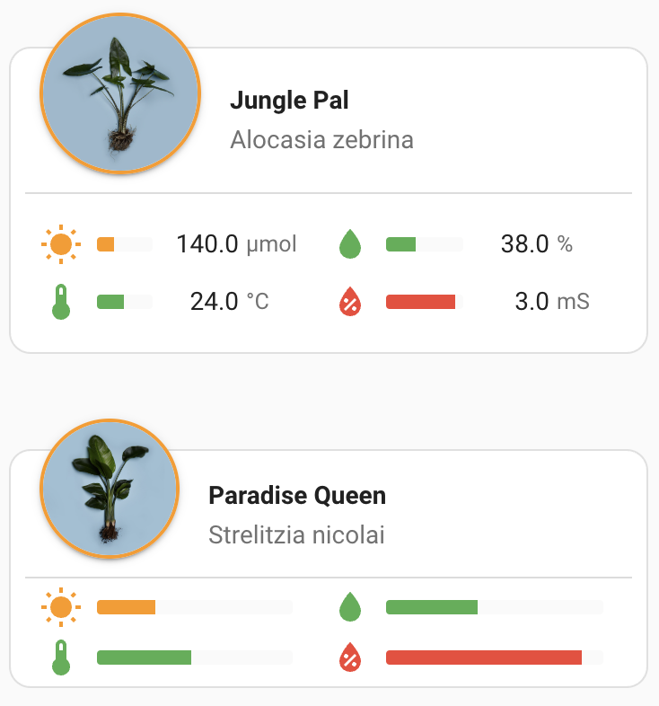

# HomeAssistant Fyta Plant Card
Custom card to display information of [Fyta plants](https://fyta.de/) on your Home Assistant dashboard.

You will need the [Fyta integration](https://www.home-assistant.io/integrations/fyta/) installed to use this card.



## Features

- Displays your plant's image and health status
- Shows sensor values for moisture, light, temperature, conductivity/salinity, and nutrition status as a fifth value
- Circular battery indicator around the plant image
- Customizable sensor display with ability to show/hide specific metrics
- Configurable sensor ordering to arrange values according to your preference
- Interactive tooltips showing status and current values
- Colored meters indicating the current state (too low, low, perfect, high, too high)
- Click on any sensor value to view historical time series data and trends
- Click on any element to see detailed history graphs

## How It Works


The FYTA Plant Card connects to your FYTA device entities through Home Assistant, displaying:
- Current sensor readings (moisture, light, temperature, conductivity)
- Nutrition status as an additional metric
- Plant status with color-coded indicators
- Interactive elements that show detailed information when clicked
- Battery status with an intuitive circular indicator

### HomeAssistant Integration

This card works with the official [Home Assistant FYTA integration](https://www.home-assistant.io/integrations/fyta/). The integration communicates with the FYTA Cloud API to retrieve your plant data and makes it available as entities in Home Assistant. Once the integration is set up, this card provides a beautiful visualization of that data.

To set up the FYTA integration in Home Assistant:
1. Go to Settings → Devices & Services
2. Click "Add Integration" and search for "FYTA"
3. Follow the prompts to connect your FYTA account
4. Once connected, your FYTA plants will be available as entities

The FYTA Plant Card then uses these entities to display your plant information in an intuitive and visually appealing way on your dashboard.

## Installation

1. Download `fyta-plant-card.js` from the [latest release](https://github.com/FYTA-GmbH/fyta-plant-card/blob/main/dist/fyta-plant-card.js).
2. Using the File editor add-on, create the `config/www` folder if it doesn't exist yet, and upload the file to this folder.
3. Ensure you have advanced mode enabled (accessible via your username in the bottom left corner)
4. Go to any dashboard where you have edit rights, click on "Edit" in the top right corner, then click the three dots menu and select "Manage resources".
5. Add `/local/fyta-plant-card.js` with type JS module.
6. Refresh the page or restart Home Assistant for the card to appear in your dashboard. If the card doesn't appear, try clearing your browser cache.

### Video Installation Guide

Please note that while the card has been updated since this video was created, the basic installation procedure remains the same. For a visual guide on how to install and configure the card, check out this video tutorial:

[](https://youtu.be/KS1u91yYSsE)

## Usage

After adding the card to your dashboard, you can:
- Click on the plant name or image to see detailed plant information
- Click on any sensor to see its historical data graph
- Hover over sensors to see tooltips with detailed status information
- Hover over the battery circle indicator to see exact battery percentage


### Status Indicators

The card uses color-coded indicators to show the status of each measurement:
- 🟢 **Green**: Perfect condition
- 🟡 **Yellow**: High or Low (needs attention)
- 🔴 **Red**: Too High or Too Low (critical - immediate attention needed)
- ⚪ **Gray**: No data available

### Battery Indicator

The circular indicator around the plant image shows the battery level:
- The circle fills clockwise, with a full circle representing 100% battery
- Colors change based on battery level (green for good, yellow for low, red for critical)
- Hover over the circle to see the exact percentage and status

## Configuration Options

The custom card comes with a visual card editor, which facilitates the selection of the desired Fyta plant.

For configuration in YAML mode, the following parameters are available:

| Name              | Type    | Requirement  | Description                                            |
| ----------------- | ------- | ------------ | ------------------------------------------------------ |
| type              | string  | **Required** | `custom:fyta-plant-card`                               |
| device_id         | string  | **Required** | Device ID of the plant in Home Assistant               |
| title             | string  | **Optional** | Card title (by default this will be the plant name)    |
| display_mode      | string  | **Optional** | `full` or `compact` (default: `full`)                  |
| show_light        | boolean | **Optional** | Show light sensor (default: `true`)                    |
| show_moisture     | boolean | **Optional** | Show moisture sensor (default: `true`)                 |
| show_temperature  | boolean | **Optional** | Show temperature sensor (default: `true`)              |
| show_salinity     | boolean | **Optional** | Show salinity/EC sensor (default: `true`)              |
| show_nutrition    | boolean | **Optional** | Show nutrition status (default: `true`)                |
| light_order       | string  | **Optional** | Display order for light (1-5, default: `1`)            |
| moisture_order    | string  | **Optional** | Display order for moisture (1-5, default: `2`)         |
| temperature_order | string  | **Optional** | Display order for temperature (1-5, default: `3`)      |
| salinity_order    | string  | **Optional** | Display order for salinity (1-5, default: `4`)         |
| nutrition_order   | string  | **Optional** | Display order for nutrition (1-5, default: `5`)        |

## Example Configuration

```yaml
type: 'custom:fyta-plant-card'
device_id: 12345abc67890def123456
title: My Lovely Monstera
display_mode: full
show_light: true
show_moisture: true
show_temperature: true
show_salinity: true
show_nutrition: true
light_order: '1'
moisture_order: '2'
temperature_order: '3'
salinity_order: '4'
nutrition_order: '5'
```

## Display Order and Layout

The card supports customizing the order of sensors displayed:
- Each sensor can be assigned a value from 1-5 (lower numbers appear first)
- With an odd number of sensors, the last one (highest order number) appears full-width at the bottom
- With an even number of sensors, they are distributed in two columns
- You can hide any sensor by toggling its corresponding show option to `false`

## Troubleshooting

If you encounter any issues with the card:

1. Make sure the Fyta integration is properly set up and your plants are connected
2. Verify that your plant's device ID is correct
3. Check the browser console for any error messages
4. Report any bugs or request features on the GitHub issues page

## Contributing

Feel free to fork the project and submit pull requests with improvements or fixes. For major changes, please open an issue first to discuss what you would like to change.

## Acknowledgements

This card was inspired by and adapted from [Olen's lovelace-flower-card](https://github.com/Olen/lovelace-flower-card). The design aesthetic, layout, and several functional aspects were based on this excellent work. Many thanks to @Olen and the contributors to that project for creating such a useful card that served as a template for this implementation.

## License

This project is licensed under the GNU General Public License v3.0 (GPL-3.0) - see the [LICENSE](LICENSE) file for details. This license ensures that all modified versions of the code remain freely available to the community. Any derivative work must also be distributed under the same license terms.
